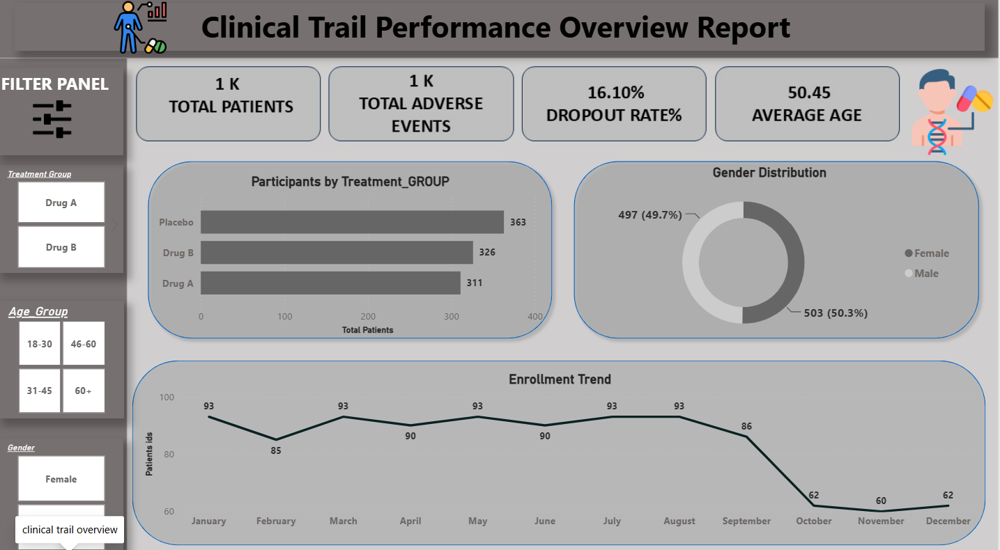
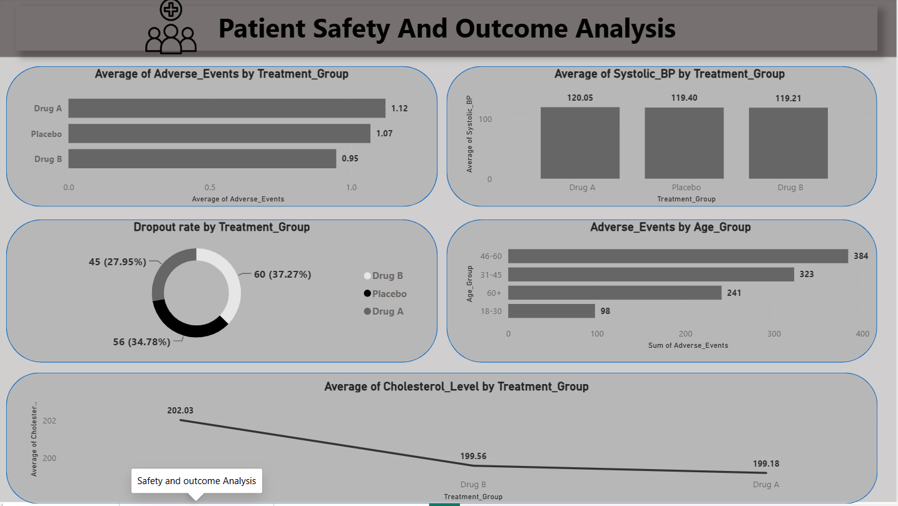

## Clinical Trial Analytics Dashboard - Power BI

## Project Overview
This is my first Power BI dashboard project focused on analyzing clinical trial data and generating meaningful insights through interactive visualizations.

## Dashboard Highlights
- Participant Analysis by Age Group and Gender
- Treatment Group Distribution
- Adverse Events and Dropout Analysis
- Enrollment Trends Over Time
- Blood Pressure and Cholesterol Analysis

## Interactive Filters
- Age Group
- Gender
- Treatment Group
- Site ID
- Enrollment Date

## Tools Used
- Power BI
- Excel
- Power Query
- DAX

## Skills Gained
- Data Cleaning and Transformation
- Data Modeling
- Dashboard Design
- Data Visualization
- Data Storytelling

  ## Dashboard Preview

### Overview

### Safety  Analysis

